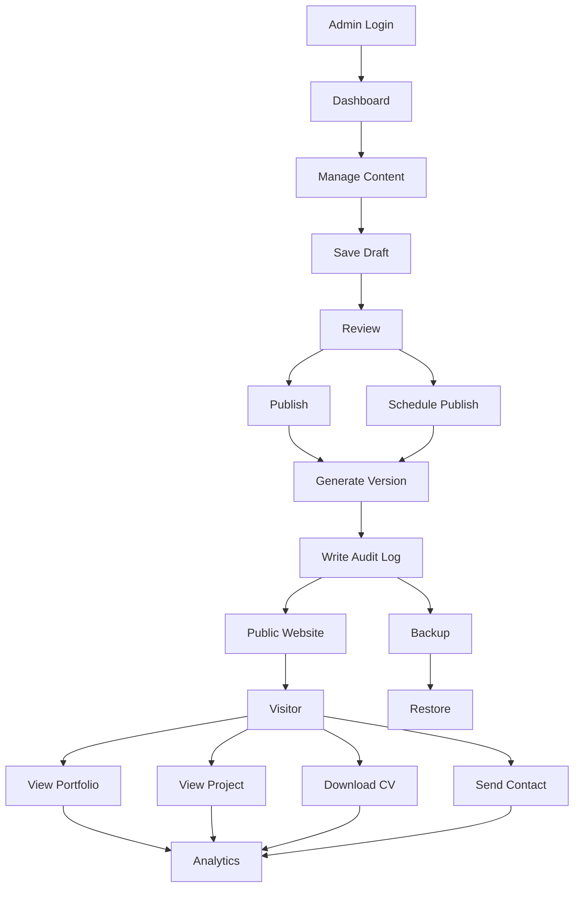

# System Overview

## Mục đích

- MyPortfolio là một hệ thống quản lý và trình bày hồ sơ cá nhân trên nền tảng
  web, giúp chủ sở hữu giới thiệu năng lực chuyên môn, kinh nghiệm, kỹ năng, dự
  án và thành tựu tới nhà tuyển dụng hoặc đối tác.
- Hệ thống cho phép chủ sở hữu chủ động quản lý, cập nhật và xuất bản nội dung
  thông qua một khu vực quản trị riêng (khác với website tĩnh).

## Bối cảnh

- Việc cập nhật CV/portfolio trên nhiều nền tảng tốn thời gian, phân tán và
  thiếu tính nhất quán.
- Các website cá nhân thường thiếu tính năng quản trị nội dung, theo dõi tương
  tác và quản lý lịch sử thay đổi.
- MyPortfolio cung cấp một hệ thống tập trung để quản lý và công bố hồ sơ từ một
  nguồn dữ liệu duy nhất.

# Business Objectives

- **BO-01:** Xây dựng thương hiệu cá nhân chuyên nghiệp.
- **BO-02:** Giúp nhà tuyển dụng dễ dàng đánh giá năng lực của ứng viên.
- **BO-03:** Cho phép chủ sở hữu cập nhật hồ sơ bất cứ lúc nào mà không cần
  chỉnh sửa mã nguồn.
- **BO-04:** Quản lý tập trung tất cả thông tin: Hồ sơ, Dự án, Kinh nghiệm, Kỹ
  năng, Chứng chỉ, Học vấn, Blog, CV.
- **BO-05:** Theo dõi mức độ quan tâm của nhà tuyển dụng thông qua các chỉ số
  tương tác.
- **BO-06:** Hỗ trợ tối ưu khả năng hiển thị trên công cụ tìm kiếm và khi chia
  sẻ lên mạng xã hội.
- **BO-07:** Cho phép chủ sở hữu theo dõi lịch sử phát triển của portfolio và
  khôi phục nội dung khi cần.
- **BO-08:** Cho phép chủ sở hữu lập kế hoạch xuất bản nội dung theo thời gian.
- **BO-09:** Hỗ trợ quản lý portfolio như một hệ thống CMS hoàn chỉnh thay vì
  website tĩnh.

# Actors

- **Portfolio Owner:** Chủ sở hữu và quản trị hệ thống.
- **Recruiter:** Xem hồ sơ và đánh giá ứng viên.
- **Visitor:** Khách truy cập.

# Scope

## In Scope

- **Public Website:** Hiển thị hồ sơ cá nhân, dự án, kỹ năng, kinh nghiệm, học
  vấn, chứng chỉ, blog; Cho phép tải CV, gửi thông tin liên hệ.
- **Content Management:** Quản trị hồ sơ, dự án, kỹ năng, kinh nghiệm, học vấn,
  chứng chỉ, blog, CV, hình ảnh, tin nhắn.
- **Content Lifecycle:** Tạo mới, chỉnh sửa, lưu bản nháp, xuất bản, lưu trữ và
  khôi phục. Đảm bảo chỉ nội dung đã xuất bản mới được hiển thị công khai.
- **Portfolio Analytics:** Thu thập và hiển thị các chỉ số tương tác để đánh giá
  mức độ quan tâm.
- **Audit:** Ghi nhận lịch sử chỉnh sửa và thao tác đối với các nội dung quan
  trọng.
- **SEO:** Cấu hình thông tin SEO (tùy chọn) phục vụ tối ưu hóa công cụ tìm kiếm
  và chia sẻ mạng xã hội.
- **Content Version Management:** Quản lý nhiều phiên bản nội dung quan trọng,
  hỗ trợ khôi phục phiên bản trước đó.
- **Scheduled Publishing:** Cấu hình thời điểm xuất bản hoặc ngừng xuất bản nội
  dung tự động.
- **Backup & Restore (Logical):** Sao lưu và khôi phục dữ liệu nghiệp vụ.

## Out of Scope

- Đăng ký tài khoản công khai.
- Mạng xã hội nội bộ.
- Thanh toán trực tuyến.
- Chat thời gian thực.
- Đa quản trị viên (ở phiên bản đầu).

# Business Requirements

| Mã    | Nhóm nghiệp vụ       | Mô tả Yêu cầu                                                                                                                       |
| ----- | -------------------- | ----------------------------------------------------------------------------------------------------------------------------------- |
| BR-01 | Public website       | Hệ thống phải cho phép khách truy cập xem toàn bộ thông tin được công bố.                                                           |
| BR-02 | Content Management   | Hệ thống phải cho phép chủ sở hữu quản lý toàn bộ nội dung thông qua khu vực quản trị.                                              |
| BR-03 | Content lifecycle    | Hệ thống phải hỗ trợ xuất bản và quản lý trạng thái của nội dung. Đảm bảo chỉ nội dung xuất bản mới hiển thị công khai.             |
| BR-04 | Audit                | Hệ thống phải lưu trữ lịch sử thao tác và chỉnh sửa của người quản trị đối với nội dung quan trọng.                                 |
| BR-05 | File Management      | Hệ thống phải hỗ trợ quản lý các tài liệu và tệp đính kèm như CV, ảnh và chứng chỉ.                                                 |
| BR-06 | Portfolio Analytics  | Hệ thống phải cung cấp các chỉ số thống kê về mức độ tương tác của người dùng.                                                      |
| BR-07 | SEO                  | Hệ thống phải hỗ trợ cấu hình thông tin SEO và tối ưu hóa khả năng hiển thị của nội dung trên công cụ tìm kiếm và nền tảng chia sẻ. |
| BR-09 | Content Version      | Hệ thống phải hỗ trợ lưu trữ nhiều phiên bản và khôi phục nội dung về một phiên bản trước đó.                                       |
| BR-11 | Scheduled Publishing | Hệ thống phải hỗ trợ lên lịch xuất và ngừng xuất bản nội dung.                                                                      |
| BR-13 | Backup & Restore     | Hệ thống phải hỗ trợ sao lưu và khôi phục dữ liệu nghiệp vụ.                                                                        |

# Business Rules

- **BRULE-01:** Chỉ các nội dung có trạng thái Published mới được hiển thị trên
  website công khai.
- **BRULE-02:** Nội dung ở trạng thái Draft hoặc Archived không được phép hiển
  thị công khai.
- **BRULE-03:** Mỗi nội dung chỉ được phép có một trạng thái tại một thời điểm.
- **BRULE-04:** Khi một nội dung được Publish, hệ thống phải tạo một phiên bản
  (Version) mới của nội dung đó.
- **BRULE-05:** Mỗi lần chỉnh sửa nội dung phải được ghi nhận trong Audit Log.
  Audit log lưu tối thiểu: Người thực hiện, thời gian thực hiện, loại thao tác
  và đối tượng bị tác động.
- **BRULE-06:** Việc khôi phục phiên bản không được làm mất lịch sử các phiên
  bản trước đó. Không được phép xóa vĩnh viễn một phiên bản đã lưu (chỉ đánh dấu
  vô hiệu lực hoặc khôi phục phiên bản khác).
- **BRULE-07:** Chỉ Portfolio Owner mới có quyền tạo, chỉnh sửa, xuất bản, lưu
  trữ hoặc xóa nội dung.
- **BRULE-08:** Khách truy cập chỉ có quyền xem và gửi thông tin liên hệ, không
  được chỉnh sửa dữ liệu.
- **BRULE-09:** Mỗi lượt tải CV, xem dự án hoặc gửi biểu mẫu liên hệ phải được
  ghi nhận để phục vụ thống kê.
- **BRULE-10:** Các tệp tải lên phải thuộc các định dạng được hệ thống cho phép.
- **BRULE-11:** Một nội dung có thể được lên lịch xuất bản hoặc ngừng xuất bản
  tại một thời điểm xác định. Hệ thống tự động thay đổi trạng thái khi đến lịch
  mà không cần thao tác thủ công.
- **BRULE-13:** Mỗi Project phải có ít nhất một tiêu đề và một mô tả trước khi
  được Publish. Mỗi Project chỉ có một URL công khai duy nhất để phục vụ SEO và
  chia sẻ.
- **BRULE-15:** Các trường SEO (Title, Description và Open Graph Image) là tùy
  chọn, nhưng nếu được khai báo thì phải được sử dụng khi hiển thị hoặc chia sẻ
  nội dung.

# Constraints

- **CT-01:** Hệ thống chỉ hỗ trợ một tài khoản quản trị.
- **CT-02:** Không hỗ trợ đăng ký tài khoản công khai.
- **CT-03:** Không hỗ trợ nhiều Portfolio trong cùng một hệ thống.
- **CT-04:** Không hỗ trợ phân quyền nhiều cấp trong phiên bản đầu tiên.
- **CT-05:** Không hỗ trợ đa ngôn ngữ trong phiên bản đầu tiên.
- **CT-06:** Không tích hợp thanh toán trực tuyến.
- **CT-07:** Không hỗ trợ trò chuyện thời gian thực (Real-time Chat).
- **CT-08:** Chỉ các nội dung ở trạng thái Published mới được hiển thị công
  khai.
- **CT-09:** Việc sao lưu và khôi phục dữ liệu chỉ áp dụng ở mức dữ liệu nghiệp
  vụ (Logical Backup).

# Assumptions

- **AS-01:** Hệ thống chỉ phục vụ cho một chủ sở hữu (Portfolio Owner).
- **AS-02:** Khách truy cập không cần đăng nhập để xem các nội dung đã được xuất
  bản.
- **AS-03:** Chỉ Portfolio Owner có quyền truy cập khu vực quản trị.
- **AS-04:** Portfolio Owner chịu trách nhiệm về tính chính xác và hợp pháp của
  toàn bộ nội dung được công bố.
- **AS-05:** Hệ thống được triển khai dưới dạng ứng dụng web và người dùng truy
  cập thông qua trình duyệt.
- **AS-06:** Người dùng có kết nối Internet ổn định khi truy cập hệ thống.
- **AS-07:** Tất cả dữ liệu được lưu trữ tập trung trong cơ sở dữ liệu của hệ
  thống.
- **AS-08:** Các tệp như CV, hình ảnh và chứng chỉ được lưu trữ trên hệ thống
  hoặc dịch vụ lưu trữ được cấu hình.

# Dependencies

| ID    | Dependency            | Mô tả                                                       |
| ----- | --------------------- | ----------------------------------------------------------- |
| DP-01 | Database              | Lưu trữ toàn bộ dữ liệu của hệ thống.                       |
| DP-02 | File Storage          | Lưu trữ hình ảnh, CV và chứng chỉ.                          |
| DP-03 | Email Service         | Gửi thông báo hoặc xử lý biểu mẫu liên hệ (nếu triển khai). |
| DP-04 | Web Hosting           | Triển khai và vận hành ứng dụng.                            |
| DP-05 | Domain Name           | Cung cấp địa chỉ truy cập công khai.                        |
| DP-06 | HTTPS/SSL Certificate | Đảm bảo kết nối an toàn giữa người dùng và hệ thống.        |
| DP-07 | Search Engine         | Thu thập dữ liệu để lập chỉ mục và tối ưu SEO.              |

# Risks

| ID  | Risk                                               | Mitigation                                              |
| --- | -------------------------------------------------- | ------------------------------------------------------- |
| R1  | Nội dung lỗi thời                                  | Cập nhật dễ dàng thông qua CMS                          |
| R2  | Nhà tuyển dụng không tìm thấy thông tin quan trọng | Thiết kế điều hướng rõ ràng và cấu trúc nội dung hợp lý |
| R3  | Mất dữ liệu khi chỉnh sửa                          | Lưu lịch sử thay đổi và hỗ trợ khôi phục                |
| R4  | Nội dung chưa hoàn thiện bị công khai              | Sử dụng cơ chế Draft/Publish                            |

# Success Criteria

- **SC-01:** Portfolio có thể cập nhật mà không cần sửa code
- **SC-02:** 100% nội dung được quản lý qua CMS
- **SC-03:** 100% thay đổi được Audit
- **SC-04:** 100% Project hỗ trợ Draft/Publish
- **SC-05:** Theo dõi được lượt xem Portfolio
- **SC-06:** Có thể Restore Version

# Business Workflow

