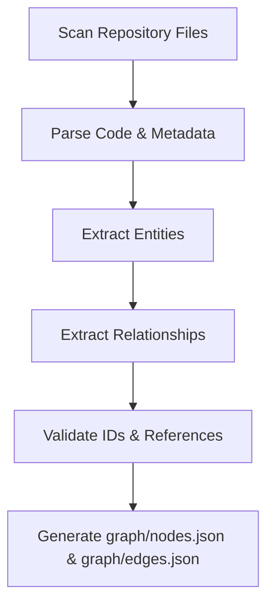
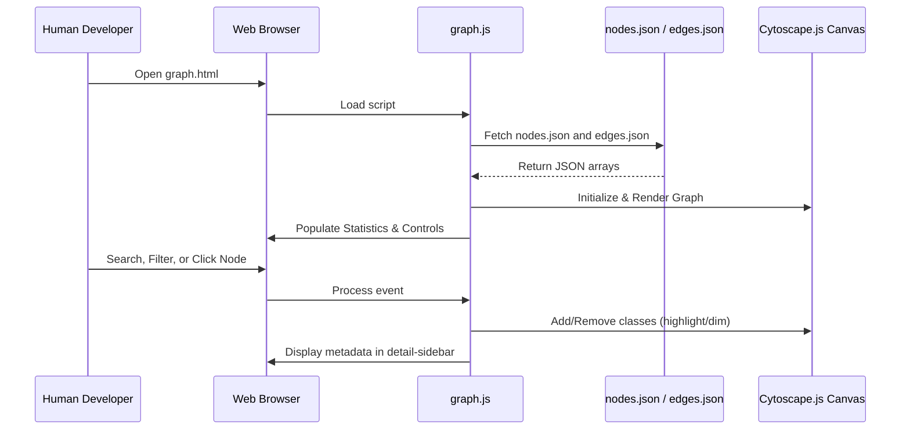

# Project Graph Navigation Framework

This folder contains a decoupled, project-independent framework designed to
navigate codebase architectures using an interactive graph. It satisfies two
primary use cases:

1. **Human Navigation**: Interactive visualization using Cytoscape.js, offering
   panning, zooming, filtering, searching, and neighborhood highlighting.
2. **AI Navigation**: An structured indexing layer serving as the primary source
   of navigation for AI Agents, allowing them to locate files, understand
   architecture, and map requirements without scanning the entire workspace.

---

## Folder Structure

```text
graph/
├── nodes.json             # Structured array of project entities (schema-defined)
├── edges.json             # Structured array of relationships between entities (schema-defined)
├── graph.html             # Main visualization viewer utilizing Cytoscape.js
├── graph.js               # Javascript controller logic for interactive Cytoscape behaviors
├── graph.css              # Dark-mode styling, responsive layouts, glassmorphism panel
└── README.md              # Framework specifications & AI Navigation Protocol (this file)
```

---

## Data Format

The framework is driven by two data files, `nodes.json` and `edges.json`. They
must conform to the following JSON schemas.

### 1. Nodes Schema (`nodes.json`)

An array of objects representing system entities.

```json
[
  {
    "id": "string (unique identifier, e.g. URI, path, or key like 'auth-module')",
    "label": "string (short human-readable name, e.g. 'Auth Module')",
    "type": "project | document | module | feature | api | database | user-flow | use-case | business-rule",
    "description": "string (brief overview details)",
    "metadata": {
      "filePath": "string (optional: relative path to the associated code file or folder)",
      "url": "string (optional: web endpoint URL for APIs)",
      "method": "string (optional: HTTP method: GET, POST, PUT, DELETE)",
      "table": "string (optional: database table name)",
      "owner": "string (optional: owner module, service or team name)",
      "params": "object / array (optional: relevant input/output parameters)"
    }
  }
]
```

### 2. Edges Schema (`edges.json`)

An array of objects defining directed links representing dependencies,
relationships, and flows between nodes.

```json
[
  {
    "source": "string (id of the source node)",
    "target": "string (id of the target node)",
    "type": "contains | links | references | depends_on | implements | belongs_to | uses | tested_by | calls | extends | inherits",
    "description": "string (optional description of the relationship)"
  }
]
```

#### Standardized Edge Catalogue

- `contains`: Folder $\rightarrow$ File (Physical folder containment tree).
- `links`: Markdown $\rightarrow$ Markdown (Internal hyperlinks, Wiki-links
  `[[wiki-link]]`, or `@mentions`).
- `references`: Code $\rightarrow$ Business Rule (Comment references, e.g.,
  `@rule BR-001`).
- `depends_on`: Module $\rightarrow$ Module (Architectural dependency, e.g.,
  `@depends_on modules/auth`).
- `implements`: Requirement / Usecase $\rightarrow$ Code (Traceability link,
  e.g., `@req REQ-015` or `@uc UC-005` in code comment).
- `belongs_to`: Feature $\rightarrow$ Module (Logical domain ownership, e.g.,
  `@belongs_to auth-module`).
- `uses`: Feature $\rightarrow$ API $\rightarrow$ Database (Functional
  dependency, e.g., `@uses db-users`).
- `tested_by`: Requirement $\rightarrow$ Test (Verification link mapping test to
  requirement, e.g., `@tested_by test-file`).
- `calls`: API $\rightarrow$ API (Service/endpoint calls).
- `extends`: Interface $\rightarrow$ Class.
- `inherits`: Class $\rightarrow$ Class.

---

## Workflows

### 1. Graph Generation Workflow

The graph files `nodes.json` and `edges.json` should be generated automatically
during build/CI steps or using background tools:



1. **Scan**: Analyze structural folders (such as `docs/`, `modules/`, `src/`).
2. **Parse & Connect**: Extract entities and relationships using reliable,
   structured methods instead of blind free-text scanning:
   - **AST Parsing**: Utilize compiler APIs (like the TypeScript Compiler API or
     Babel) to map code structures (`import`, `export`, `class`, `function`,
     `decorator`) to resolve code-level dependencies.
   - **Structured Comment Tags**: Scan comment blocks (JSDoc or inline) for
     formal tags (e.g. `@rule BR-001`, `@req REQ-015`, `@uc UC-005`,
     `@depends_on modules/auth`, `@belongs_to auth-module`, `@uses db-users`) to
     map dependencies and traceability.
   - **Wiki-links & Mentions**: Parse wiki-style `[[wiki-link]]` and `@mentions`
     in documentation files to index documentation networks.
3. **Validate**: Ensure every edge has corresponding source and target elements
   present in the node list.
4. **Output**: Write output strictly to `nodes.json` and `edges.json`.

---

### 2. Graph Viewer Workflow (Human)



---

## AI Agent Navigation Protocol

AI Agents must consult this graph as their **primary source of navigation**
instead of scanning the entire workspace. By doing so, agents drastically
minimize read tokens, avoid indexing stale files, and grasp systemic connections
instantly.

### Recommended Steps for AI Agents

1. **Understand Layout**: Read `graph/nodes.json` and `graph/edges.json` first
   to index the workspace's entities.
2. **Locate Target Node**: Search the node array where:
   - `type` is matching the target entity type (e.g. `feature`, `api`,
     `use-case`, `business-rule`).
   - `id` or `label` matches the task keyword.
3. **Trace Structural Links**:
   - To inspect documentation related to a rule or usecase: Follow the `defines`
     or `references` edge to locate `document` nodes, and read the file
     specified in `metadata.filePath`.
   - To find the code implementation of a feature: Trace the `owns` or
     `contains` incoming edges to locate the owning `module`, and inspect its
     directory structure.
   - To trace API data flow: Find the `api` node, follow the `implements` or
     `depends_on` edge to identify related `database` tables (using `reads` or
     `writes` relationships).
4. **Execute Narrow Actions**: Only open files mapped directly within the
   metadata of the resolved nodes. Do NOT traverse directories blindly.
