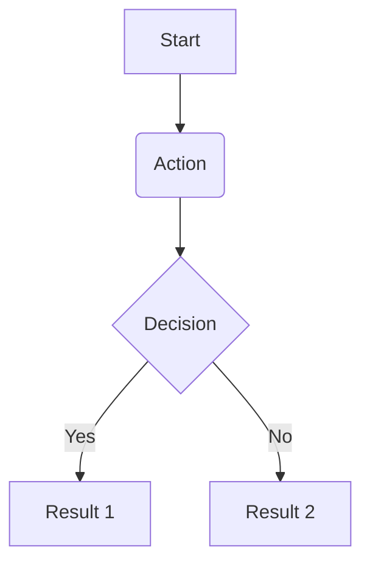

# Sample Module Flow

> [!NOTE] **EN:** Document the user flows and system interactions within this
> module using Mermaid diagrams. **VI:** Ghi chú lại luồng người dùng và tương
> tác hệ thống trong module này bằng biểu đồ Mermaid.

## User Flow

